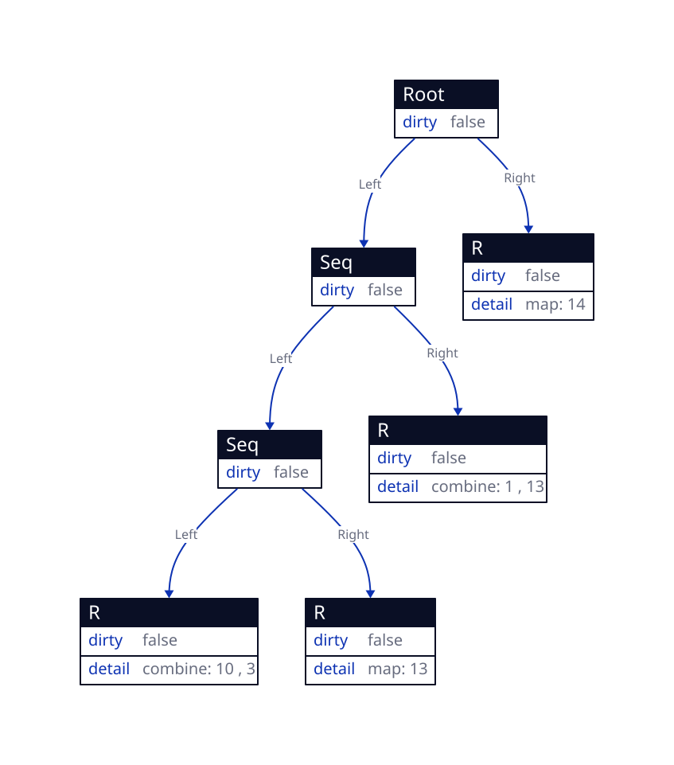
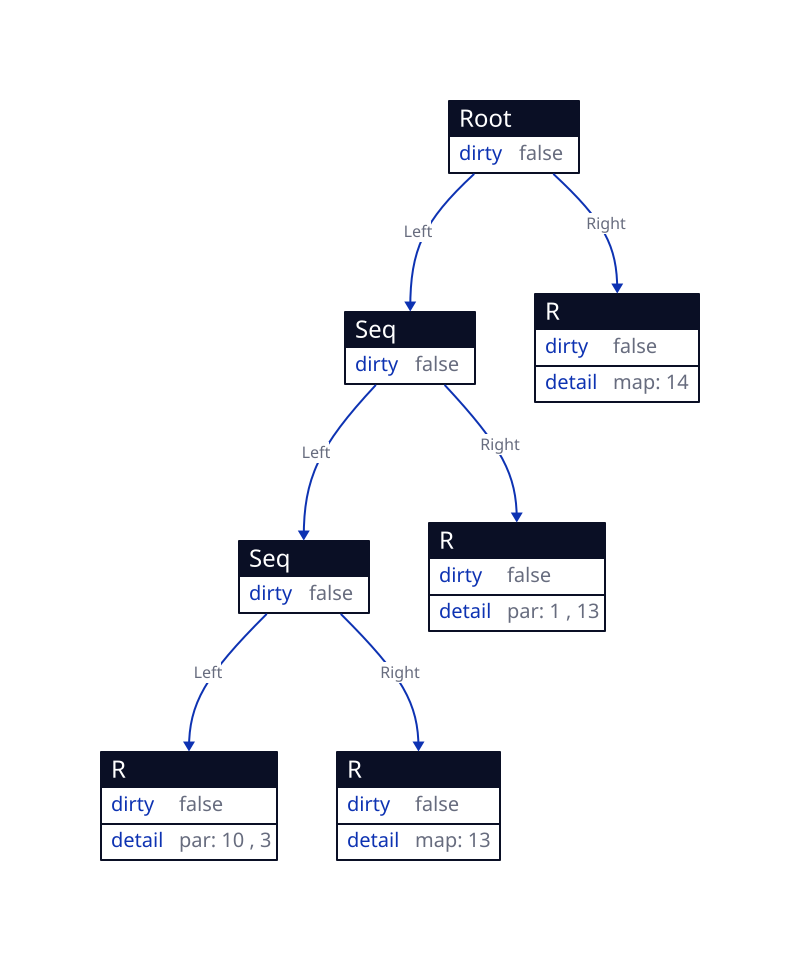

## What is incremental computation?

\pause

- Software feature which, whenever a piece of data changes, attempts to save
  time by only recomputing those outputs which depend on the changed data.
  \pause
- Example: Excel, GUIs (e.g. React), Build systems, etc.
  \pause
- A bit more detailed description at [Introducing Incremental](https://blog.janestreet.com/introducing-incremental/)

## Par_incr

\pause

- Based on [Efficient Parallel Self-Adjusting Computation](https://drive.google.com/file/d/130-sCY1YPzo4j3YAJ7EL9-MflK0l8RmJ/view?pli=1)(sort of a follow up paper to [Adaptive Functional Programming](https://drive.google.com/file/d/1OfcnkoTCxWUaTGc570oV-D8fWx30Lvtx/view?usp=sharing))

\pause
::: columns

:::: {.column }

### Existing similar libraries

- [current_incr](https://github.com/ocurrent/current_incr)
- [Jane Street's incremental](https://github.com/janestreet/incremental)

::::

:::: {.column }
\pause

### So what's different?

\pause

- You can leverage freshly introduced parallelism in \texttt{Par\textunderscore incr}

::::

:::

## How do we use the library?

\pause

We need to know about a few types before that

\pause

- \texttt{\textcolor{red}{'a Par\textunderscore incr.Var.t}}: Handle to the input of some
  computation. Changing this should correctly propagate changes

\pause

- \texttt{\textcolor{red}{'a Par\textunderscore incr.t}} : This is different
  from \texttt{Var.t}. You call \texttt{Var.watch} on a \texttt{Var.t} to get
  \texttt{Par\textunderscore incr.t}. The library provides combinators that
  operate on this to make larger computations.

\pause

- \texttt{\textcolor{red}{'a Par\textunderscore incr.computation}}: When you run \texttt{'a Par\textunderscore incr.t}, you'll obtain \texttt{'a
  computation}. This internally stores everything required to propagate changes.

## How do we use the library?(continued)

\footnotesize

```ocaml
module Cutoff : sig
  type 'a t =
  | Never
  | Always
  | Phys_equal
  | Eq of ('a -> 'a -> bool)
  | F of (oldval:'a -> newval:'a -> bool)

  val attach : 'a t -> 'a incremental -> 'a incremental
end
```

\normalsize

## How do we use the library?(continued)

\footnotesize

```ocaml
module Var : sig
  type 'a t
  val create : ?cutoff:'a Cutoff.t -> ?to_s:('a -> string) -> 'a -> 'a t
  val set : 'a t -> 'a -> unit
  val value : 'a t -> 'a
  val watch : 'a t -> 'a incremental
  module Syntax : sig
    val ( := ) : 'a t -> 'a -> unit
    val ( ! ) : 'a t -> 'a
  end
end
```

\normalsize

## How do we use the library? (continued)

\footnotesize

```ocaml
type 'a t
type 'a computation
type executor = {
  run : 'a. (unit -> 'a) -> 'a;
  par_do : 'a 'b. (unit -> 'a) -> (unit -> 'b) -> 'a * 'b;
}
module Cutoff: sig ... end
module Var : sig ... end
val return : 'a -> 'a t
val map : ?cutoff:'b Cutoff.t -> fn:('a -> 'b) -> 'a t -> 'b t
val map2 :
  ?cutoff:'c Cutoff.t ->
  ?mode:[`Par | `Seq] -> fn:('a -> 'b -> 'c) -> 'a t -> 'b t -> 'c t
val combine : 'a t -> 'b t -> ('a * 'b) t
val bind : fn:('a -> 'b t) -> 'a t -> 'b t
val par : left:'a t -> right:'b t -> ('a * 'b) t
val delay : (unit -> 'a t) -> 'a t
val value : 'a computation -> 'a
val run : executor:executor -> 'a t -> 'a computation
val propagate : 'a computation -> unit
val destroy_comp : 'a computation -> unit
```

\normalsize

## How do we use the library? (continued)

\pause

- Define \texttt{Var.t} with some value.
  \pause
- Perform \texttt{Var.watch} operation on \texttt{Var.t} and change it to \texttt{incremental}(\texttt{Par\textunderscore incr.t}).
  \pause
- Use different combinators provided by the library on the \texttt{incremental}s and
  make even bigger \texttt{incremental}s.
  \pause
- Obtain value of a certain \texttt{incremental} by running it.
  \pause
- Running an \texttt{'a incremental} returns a \texttt{'a computation}.
  \pause
- When we change a \texttt{Var.t}(done with \texttt{Var.set} operation), it marks all
  dependent computations dirty.
  \pause
- Running \texttt{propagate} operation on a dirty \texttt{computation} updates its value
  efficiently.
  \pause
- Destroy (with \texttt{destroy\textunderscore comp} operation) \texttt{computation} when its no more
  required.

## Example

\scriptsize

::: columns

:::: {.column}

### Sequential sum_range

```ocaml
let rec sum_range ~lo ~hi xs =
  Par_incr.delay @@ fun () ->
  if hi - lo <= 1 then begin
    xs.(lo)
  end
  else
    let mid = lo + ((hi - lo) asr 1) in
    Debug.attach ~fn:Int.to_string
      Par_incr.Syntax.(
        let+ lhalf = sum_range ~lo ~hi:mid xs
        and+ rhalf = sum_range ~lo:mid ~hi xs in
        lhalf + rhalf)
```

::::

:::: {.column}

\pause

### Parallel sum_range

```ocaml
let rec sum_range_par ~lo ~hi xs =
  Par_incr.delay @@ fun () ->
  if hi - lo <= 1 then begin
    xs.(lo)
  end
  else
    Debug.attach ~fn:Int.to_string
      Par_incr.Syntax.(
        let mid = lo + ((hi - lo) asr 1) in
        let& lhalf = sum_range_par ~lo ~hi:mid xs
        and& rhalf = sum_range_par ~lo:mid ~hi xs in
        lhalf + rhalf)
```

::::
:::

\normalsize

## What happens internally?

Say we have something like this,

\scriptsize

```ocaml
let count = 3
let arr = Array.init count (( + ) 1) (* [1,2,3] *)
let var_arr = Array.map (Par_incr.Var.create ~to_s:Int.to_string) arr
let t_arr = Array.map Par_incr.Var.watch var_arr
let executor =
  Par_incr.
    {
      run = (fun f -> f ());
      par_do =
        (fun l r ->
          let lres = l () in
          (lres, r ()));
    }
let () =
  let seq_comp = Par_incr.run ~executor (sum_range ~lo:0 ~hi:count t_arr) in
  Par_incr.dump_tree "sum-range.d2" seq_comp;
  Var.set var_arr.(1) 10;
  Par_incr.dump_tree "sum-range-after-change.d2" seq_comp;
  Par_incr.propagate seq_comp;
  Par_incr.dump_tree "sum-range-after-prop.d2" seq_comp;
  Par_incr.destroy_comp seq_comp
```

\normalsize

## What happens internally?(continued)

{width=60%}

## What happens internally?(continued)

{width=60%}

## What happens internally?(continued)

{width=60%}

## What happens internally?(continue)

{width=55%}

## Performance

\pause

- Sequential performance within 2-4x of \texttt{Janestreet incremental} and
  pretty much always faster than \texttt{Current\textunderscore incr} \pause
- Performance for parallelizable programs is almost always faster than
  \texttt{Janestreet incremental}. Sometimes by a lot and sometimes barely.
  \pause

- [Link to benchmarks](https://gist.github.com/dipeshkaphle/a5e415b66e62a8c2827788dfdae8f08d)

## Challenges

\pause

- Diverting from the paper to a more functional style implementation
  \pause
- Improving performance
  \pause
  - Having a standard documentation or a place to refer what optimizations kick
    in different cases would be super helpful.
    \pause
  - Compiler could inline stuff across module to some extent, but couldn't
    inline some larger functions even when I wanted to(with the
    \textcolor{red}{[@inlined]} annotation). Something like this should be
    possible, and it can help immensely in optimization experiments.
    \pause
- Profiling tools

## Future Scope

\pause

- Library can probably be made faster, but it'll mostly require some major changes
  \pause
- Implement some more programs using \texttt{Par\textunderscore incr}
  \pause
- Implement the core of Differential Dataflow using \texttt{Par\textunderscore incr}

# \textcolor{red}{THANK YOU}
